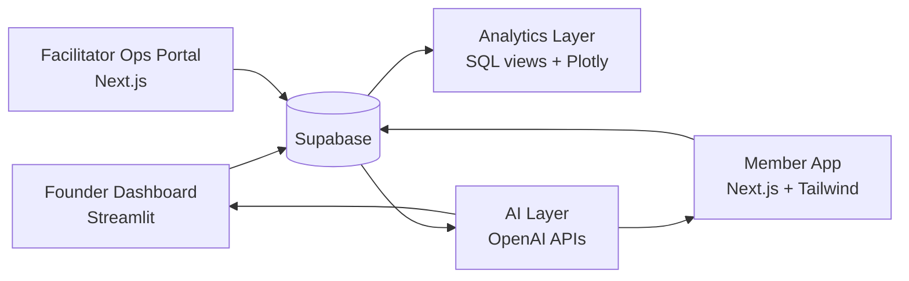

# nook v6 architecture

## system map

## app responsibilities

Founder dashboard:
- Live KPI metrics
- Revenue analytics
- Conversion funnel
- Member retention
- Event builder
- Messaging center
- Risk alerts

Member app:
- Browse curated events
- Smart recommendations
- Book and pay
- Referral rewards
- Community profile
- Feedback

Facilitator ops portal:
- Session roster
- Check-in tools
- Incident notes
- Attendance
- Feedback upload

## data flow

1. Members sign up or log in through Supabase Auth.
2. Member profile rows live in `members`.
3. Founder creates events in Streamlit, persisted to Supabase.
4. Member app reads eligible events and writes bookings.
5. Facilitators see only assigned events and roster data.
6. AI jobs read member/event/feedback data and write scores, alerts, summaries.
7. Analytics views power Streamlit charts and founder KPIs.

## security model

- Supabase Auth owns identity.
- `users` stores role and display profile.
- Row-level security:
  - Members see their own profile/bookings plus public event fields.
  - Facilitators see assigned event rosters and feedback tools.
  - Founders/admins see all operational data.
- Server-only keys are used only in Streamlit secrets or backend API routes.

